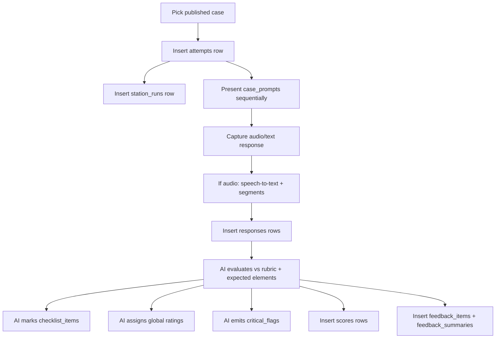

## Cloud Examiner AI Guide (OSCE-style)

This guide describes how a cloud AI should run a mock exam session using the database schema in this repo and produce examiner-like scoring + structured feedback.

### Core concepts in the database
- **Case**: a station/case scenario stored in `cases` + `case_prompts` (+ optional `case_expected_elements`)
- **Attempt**: one student doing one case (`attempts`)
- **Response**: the student’s answer to a prompt (`responses`)
- **Rubric**: domains + criteria + anchors (`rubric_sets`, `rubric_domains`, `rubric_criteria`)
- **Scoring**: domain-level score rows (`scores`)
- **Feedback**: granular items + summary (`feedback_items`, `feedback_summaries`)
- **Station run (runtime state)**: enforces one-way flow + time (`station_runs`, `station_events`)
- **Checklist (key features)**: item-level marking (`checklist_items`, `checklist_marks`)
- **Global ratings**: examiner-style overall ratings (`global_ratings`, `global_rating_marks`)
- **Safety flags**: critical/major/minor issues (`critical_flags`)

### Case types
- `case1_assessment`: assessment-focused (accepting patient, consent, subjective/objective, impression, recommendations)
- `case2_treatment_management`: treatment + management (plan, goals, safety, reassess, self-management, discharge, collaboration)

### Recommended runtime flow (end-to-end)


## Station runtime rules (must-follow)
- **One-way flow**: once a prompt with `order_index = n+1` is delivered, the response for `n` is considered locked.
- Log runtime events to `station_events`:
  - `prompt_delivered` (include `order_index`, `prompt_id`)
  - `response_received` (include `prompt_id`)
  - `time_warning` (include remaining seconds)
  - `station_locked` / `station_ended`
- Update `station_runs.current_prompt_order_index` as you advance.

## Inputs the AI should receive
The cloud AI should be called with a JSON payload like:

```json
{
  "attempt_id": "uuid",
  "case": {
    "id": "uuid",
    "title": "string",
    "case_type": "case1_assessment | case2_treatment_management",
    "prompts": [
      { "id": "uuid", "order_index": 0, "prompt_type": "stem|probe|instruction", "prompt_text": "..." }
    ],
    "expected_elements": [
      { "importance": "must|should|nice", "expected_text": "...", "rubric_criterion_id": "uuid|null" }
    ]
  },
  "rubric": {
    "rubric_set": { "id": "uuid", "name": "OCE Domains", "version": "ppt" },
    "domains": [
      {
        "id": "uuid",
        "key": "physio_expertise|communication|collaboration|management|scholarship|professionalism",
        "display_name": "string",
        "criteria": [
          { "id": "uuid", "key": "string", "description": "string", "anchors": { "0": "...", "1": "...", "2": "..." } }
        ]
      }
    ]
  },
  "responses": [
    { "prompt_id": "uuid", "response_text": "..." }
  ]
}
```

## Outputs the AI must produce
The AI returns a JSON object that can be stored directly:

```json
{
  "domain_scores": [
    {
      "rubric_domain_key": "physio_expertise",
      "score_value": 10,
      "max_value": 20,
      "rationale": "1-3 sentences with concrete evidence from the response"
    }
  ],
  "feedback_items": [
    {
      "rubric_domain_key": "physio_expertise",
      "criterion_key": "heur_3",
      "strength_text": "what they did well",
      "gap_text": "what was missing or unsafe",
      "suggestion_text": "what to do next time",
      "evidence_quotes": ["short quotes from candidate response"]
    }
  ],
  "overall_summary": "short examiner-style summary",
  "next_steps": "3-6 bullet-style next steps",
  "checklist_marks": [
    {
      "checklist_key": "string",
      "mark_value": 0,
      "evidence_quotes": ["short quotes"]
    }
  ],
  "global_ratings": [
    {
      "global_key": "overall|safety|communication",
      "score_value": 0,
      "max_value": 4,
      "rationale": "1-2 sentences"
    }
  ],
  "critical_flags": [
    {
      "flag_key": "OMISSION_RED_FLAG_SCREEN",
      "severity": "critical|major|minor",
      "description": "what was unsafe and why",
      "evidence_quotes": ["quotes"],
      "detection_confidence": 0.85
    }
  ]
}
```

## Scoring rules (recommended)
- **Be specific to the prompt intent** (don’t reward generic checklists).
- **Safety first**: unsafe advice should strongly reduce `physio_expertise` and `professionalism` domain scores.
- **Use the rubric anchors**:
  - For `OCE Domains` imported from PPT, the anchors may be placeholder 0–2. Use them consistently.
- **Max scores**:
  - If you want a single overall score, compute weighted sum of domains in your app layer.

### Concision + prioritization (to feel like a real exam)
Add these rules to every evaluation:
- **Reward “top priorities first”**: if the candidate leads with the correct safety/clinical priority in the first ~10 seconds, increase `communication` and `physio_expertise`.
- **Penalize rambling** (even if content exists somewhere):
  - If the candidate is unstructured, repetitive, or delays safety-critical items until late, cap `communication` and reduce `management`/`professionalism` as appropriate.
- **Time realism**: if your UI enforces per-question timeboxes, mark missing “must” elements as missed even if the candidate says “I would also…” after time.

### Canada-style communication checks (high yield)
In `communication` and `professionalism`, explicitly look for:
- **Signposting** (“First I’ll…, then I’ll…”)
- **Plain-language consent** + “stop signal”
- **Teach-back** (“Can you tell me in your own words…?”)
- **Safety-netting** (“If you notice X, seek urgent care…”)

## DB writeback mapping
1) Insert/update **scores**:
   - For each `domain_scores[]` create a row in `scores` with:
     - `attempt_id`
     - `rubric_domain_id` (look up by domain key)
     - `score_value`, `max_value`, `weight_applied` (optional)

2) Insert **feedback_items**:
   - Map `rubric_domain_key` → `rubric_domain_id`
   - Map `criterion_key` → `rubric_criteria.id` (optional)
   - Store `evidence_spans` as JSON list of `{ quote, prompt_id }` or simple quotes.

3) Insert **feedback_summaries** (one per attempt):
   - `overall_summary`
   - `next_steps`
   - `generated_by` should include model + version.

4) Insert **checklist_marks** (optional but recommended):
   - Case authoring creates `checklist_items` per case (key features).
   - AI returns `checklist_key` + `mark_value` + evidence; write to `checklist_marks`.

5) Insert **global_rating_marks**:
   - Define global ratings per rubric set in `global_ratings` (e.g., overall/safety/communication).
   - AI returns global ratings; write to `global_rating_marks`.

6) Insert **critical_flags**:
   - Write safety issues to `critical_flags`. Use `severity` and `detection_confidence` to drive pass/fail gates.

## Quality checklist for “utmost accuracy”
- Candidate answer must include **case-specific** details (not generic PT advice).
- Must address **informed consent** and **contraindications/red flags** when relevant.
- Objective tests should be tied to a hypothesis and explain **why**.
- Treatment plan should include:
  - education + self-management
  - progression and reassessment criteria
  - precautions and monitoring
  - collaboration/referral triggers

### Feedback format (recommended)
For each probe, feedback should include:
- **What you led with (first 10 seconds)**: was it the correct priority?
- **Keep / cut**: 1–2 high-yield points to keep, 1–2 low-yield points to cut
- **If you only had 30 seconds, say this**: a model ultra-brief answer

